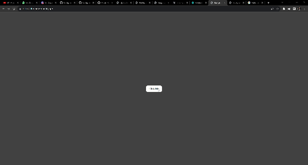

# 🚀Daily-Challenges
### Solar System Exploration, 1950s – 1960s

## 🌈 Day 1 Challenge - Dynamic Background Color

## Level: 👶🏽 Beginner

### 📋 Overview

This project is a simple, yet interactive webpage designed for beginners in web development. The core functionality of the page is a button that, when clicked, changes the background color of the page. This project demonstrates basic skills in HTML and JavaScript, particularly in manipulating the DOM.

### 🛠 Technologies Used

-   HTML
-   JavaScript

### ✨ Features

-   A button that, when clicked, changes the background color of the page.
-   Use of JavaScript to manipulate the DOM and change CSS properties.

### 🌐 Live Demo

You can view the live demo of this project [here](https://dbgchanger.netlify.app/)

### 📸 How it looks?

#### Check out this quick demo!

## ⏲️ Day 2 Challenge - Digital Clock

## Level: Intermediate 🕵️‍♀️
### 📋 Overview 
This project is a simple, yet interactive webpage designed for beginners in web development. The core functionality of the page is just make a digital clock
### 🛠 Technologies Used

-   HTML
-   JavaScript

### 🌐 Live Demo

You can view the live demo of this project [here](https://dgownclock.netlify.app/)
### 📸 How it looks?

#### Check out this quick demo!

### 💡 Feedback and Contact

Love this project? Share your thoughts and suggestions! Reach out to me on [LinkedIn](https://www.linkedin.com/in/molla-hasim/) or leave a star on GitHub.

### 🌟 Future Enhancements

-  

### 👥 Contributing

Pull requests are welcome. For major changes, please open an issue first to discuss what you would like to change.

---

Project challenge was given by Coder's Gyan [Discord community](https://discord.gg/URhupDnHht).